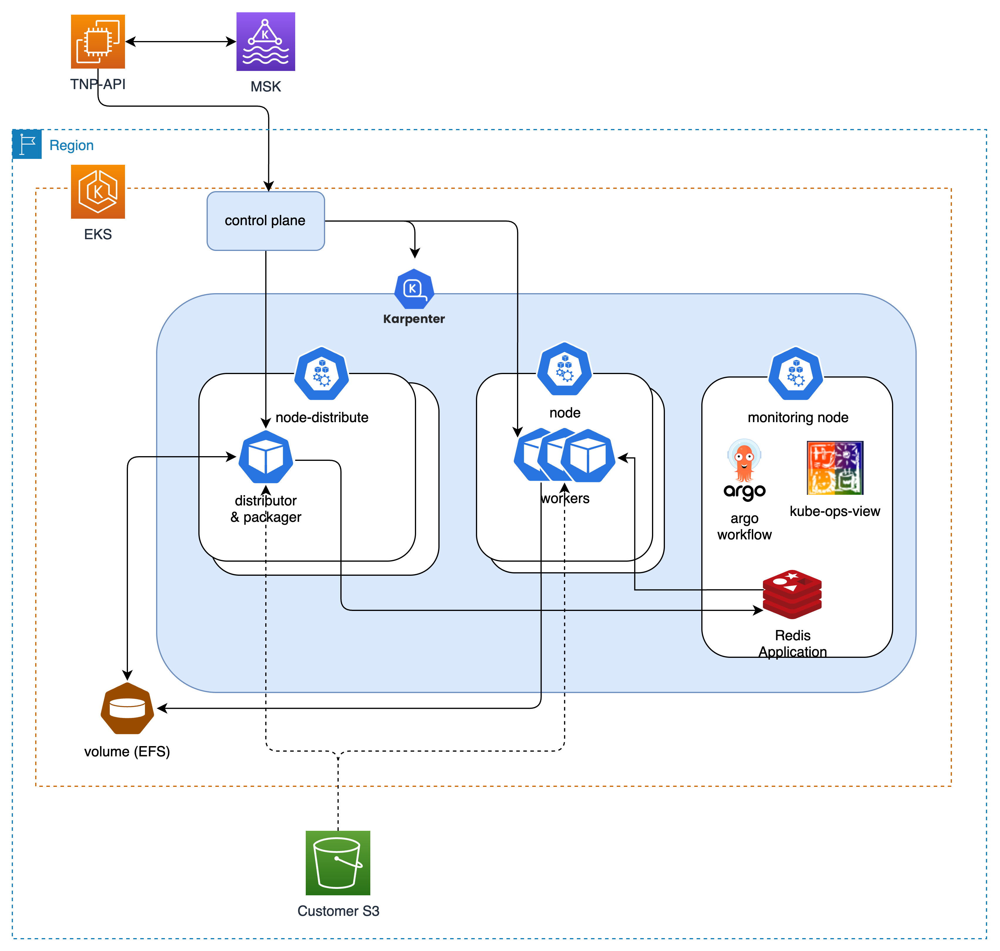
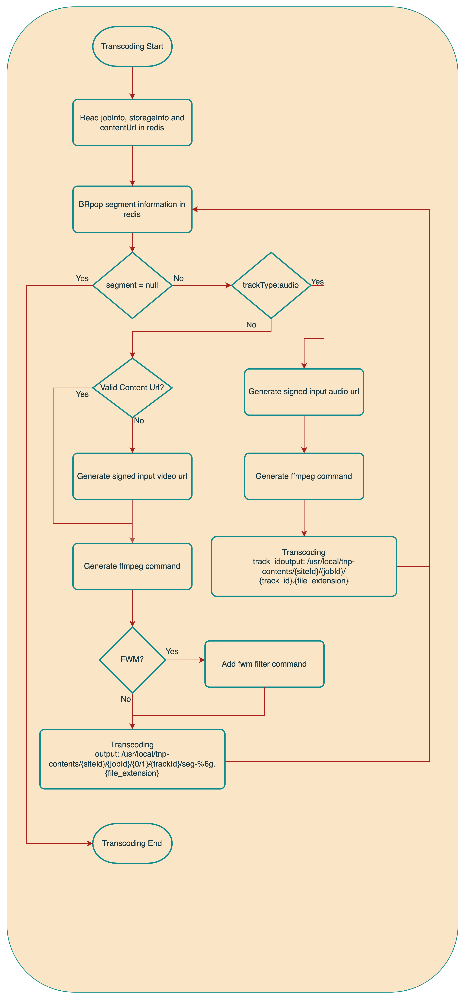

# Distributed Transcoding System

## 1. Overview

This project is a **distributed transcoding system** designed to efficiently process large video files.  
By dividing videos into time-based segments and processing them in parallel,  
then merging the transcoded pieces into a final result, the system achieves  
**over 60% improvement in processing speed**, while ensuring **scalability** and **system stability**.

---

## 2. Problem

- Transcoding large video files on a single server causes bottlenecks
- Processing time increases exponentially with complex formats
- Fixed resource usage limits scalability and cost efficiency

---

## 3. Solution

- Split video files into time-based chunks and process them **in parallel**
- Each chunk is processed as an individual **EKS Job**
- Use **Redis** to track job status and coordinate distributed tasks
- Merge transcoded chunks in sequence to generate the final video

---

## 4. System Architecture

> The diagram below illustrates the overall architecture of the distributed transcoding system:  

---

## 5. Transcoding Flow

> The diagram below outlines the complete flow from transcoding request to final output:  

---

## 6. Key Technical Highlights

- **Optimized Parallelism**: Distributed transcoding via EKS Jobs
- **Efficient Resource Utilization**: Maximize compute usage with segmented parallel processing
- **Scalability**: Number of jobs dynamically scales with video length and load
- **State Management**: Real-time tracking of each segment’s status using Redis

---