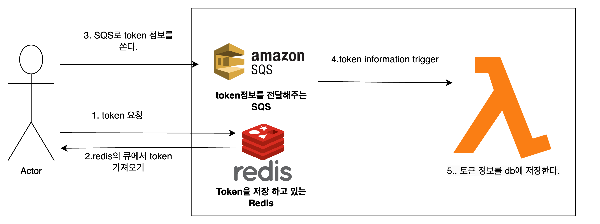
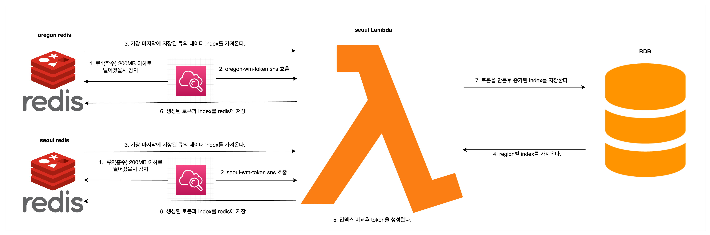

# Watermark Session Token Issuance ver2

## 1. Overview

This project was designed to resolve bottlenecks in token issuance that occurred during real-time watermark session generation.  
By improving the synchronous RDB-based architecture and applying a serverless design with a non-linear index-based algorithm,  
we achieved the following:

- Over 30% improvement in response time
- 100% duplication-free token generation
- High scalability

---

## 2. Problem

- Bottlenecks occurred under high concurrent token issuance requests
- TPS (transactions per second) limit due to synchronous RDB structure
- Locks or duplication checks required, resulting in increased latency

---

## 3. Solution

- Pre-generated token queue in Redis for instant response without DB access
- AWS Lambda asynchronously creates and stores tokens
- Introduced a collision-free token generation algorithm
- CloudWatch and SNS monitor Redis memory usage and trigger automatic token refill

---

## 4. Architecture

### Token Issuance Flow

1. User sends a token request via API
2. Redis returns a pre-issued token immediately
3. SQS message triggers Lambda
4. Lambda stores issued token information into the RDB

> Token issuance architecture:  


---

### Token Generation Flow

1. When Redis memory falls below 200MB, CloudWatch alarm is triggered
2. SNS topic invokes a single Lambda function
3. Lambda generates new tokens and stores them in Redis

> Token generation architecture:  


---

## 5. Collision-Free Token Generation Algorithm (Skew Transform Based)

### Why This Algorithm?

Previous token generation relied on random strings or UUIDs.  
To ensure uniqueness, a DB check was required, which caused:

- Bottlenecks due to duplication checks in high-concurrency environments
- Decreased TPS due to locks or transactional operations

### Our Approach

We use a Skew Transform, a non-linear mapping based on a sequential index,  
which allows deterministic, unique, and non-repeating token generation.

```python
class PseudoRandomGenerator:
    def __init__(self, a, b):
        self.a = a
        self.b = b
    def skew_transform(self, x):
        return ((self.a ^ x) + (self.b * x)) % (2**56)
    def get_number(self, index):
        if 0 <= index < 2**56:
            return self.skew_transform(index)